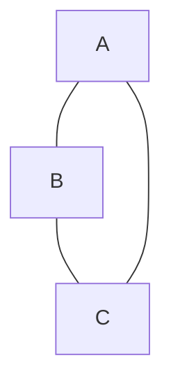
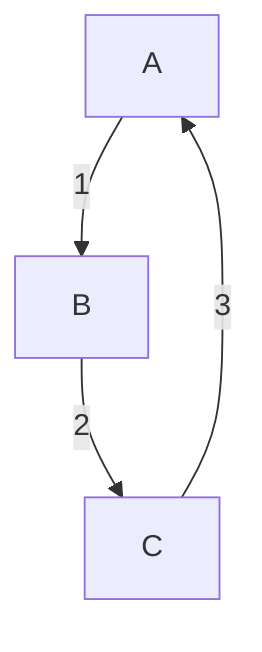
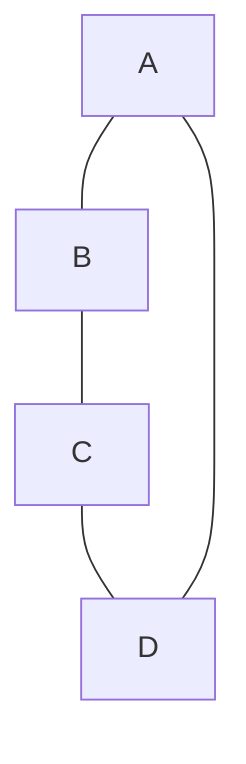
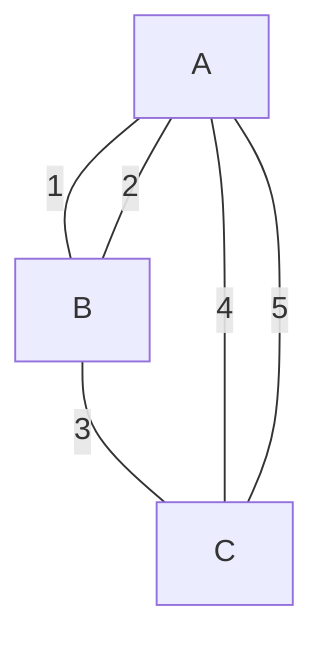
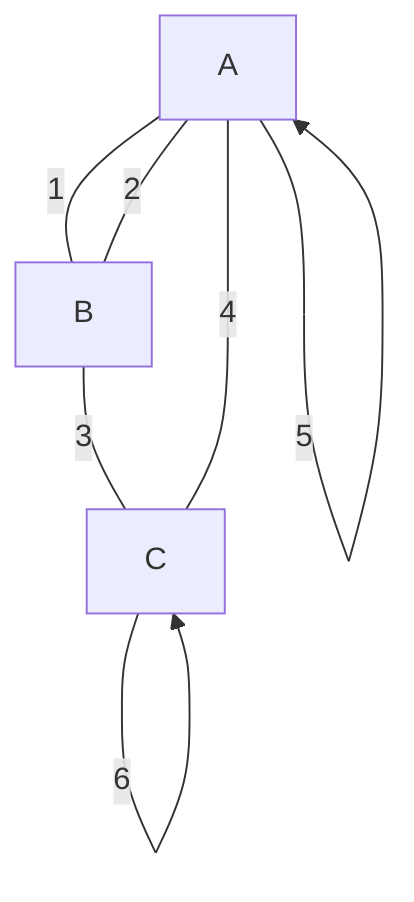

- Introduction to Graph Theory (Douglas B. West) (Z-Library)

# 图论

## 图的定义

### 分类

**图（graph）** 可以定义为由 **顶点（vertices）** 和 **边（edges）** 组成的一个数学结构。形式上，一个图 \( G \) 可以表示为一个二元组 \( G = (V, E) \)，其中：

- \( V \) 是顶点的集合，通常表示为 \( V(G) \)。
- \( E \) 是边的集合，表示为 \( E(G) \)。每条边可以被认为是两个顶点之间的连接，记作 \( (u, v) \) 或 \( \{u, v\} \)，其中 \( u, v \in V \)。

根据边的特性，图可以分为不同的种类：

1. **无向图（Undirected Graph）**：在无向图中，边没有方向，即如果 \( (u, v) \in E \)，则 \( (v, u) \) 也属于 \( E \)。边 \( \{u, v\} \) 表示一种无方向的连接。


2. **有向图（Directed Graph）**：在有向图中，边具有方向，表示从顶点 \( u \) 指向顶点 \( v \)，记作 \( (u, v) \)，此时 \( (u, v) \neq (v, u) \)。

3. **简单图（Simple Graph）**：在简单图中，任意两顶点之间最多只有一条边，且没有自环（即顶点指向自身的边）。

4. **多重图（Multigraph）**：多重图允许两个顶点之间有多条边。

5. **伪图（Pseudograph）**：伪图允许自环和多重边。


1. 无向图：边没有箭头，表示无方向。


2. 有向图：边有箭头，表示方向。



3. 简单图：每对顶点之间最多一条边，没有自环。



4. 多重图：允许两个顶点之间有多条边。




5. 伪图：包含多重边和自环（指向自身的边）。



## 途径、迹、路径、回路

在《Introduction to Graph Theory》一书中，你提到的这些概念是描述图中顶点和边的不同连接方式，具体定义如下：

1. **途径（Walk）**：  
   一个**途径**是图中顶点和边的序列。途径可以重复经过相同的顶点和边。  
   一个形式化的表示为：从顶点 \(v_0\) 开始经过边 \(e_1\)，再到达顶点 \(v_1\)，再经过边 \(e_2\)，到达顶点 \(v_2\)，依此类推，直到最终到达顶点 \(v_k\)。  
   它的形式为：  
   \[
   v_0 \xrightarrow{e_1} v_1 \xrightarrow{e_2} v_2 \cdots \xrightarrow{e_k} v_k
   \]
   其中顶点 \(v_i\) 和边 \(e_i\) 可以重复出现。

2. **迹（Trail）**：  
   一个**迹**是**不经过重复边**的途径。  
   即使顶点可以重复出现，但边不能重复。  
   形式上表示为：  
   \[
   v_0 \xrightarrow{e_1} v_1 \xrightarrow{e_2} v_2 \cdots \xrightarrow{e_k} v_k
   \]
   且 \(e_1, e_2, \dots, e_k\) 是图中互不相同的边。

3. **路径（Path）**：  
   一个**路径**是**不经过重复顶点**的途径。  
   也就是说，所有的顶点都是不同的。  
   形式上表示为：  
   \[
   v_0 \xrightarrow{e_1} v_1 \xrightarrow{e_2} v_2 \cdots \xrightarrow{e_k} v_k
   \]
   且 \(v_0, v_1, \dots, v_k\) 是图中互不相同的顶点。

4. **回路（Cycle）**：  
   一个**回路**是一个从某个顶点开始，经过一系列边和顶点，然后回到该顶点的**途径**。  
   即，**起点和终点是同一个顶点**。  
   形式上表示为：  
   \[
   v_0 \xrightarrow{e_1} v_1 \xrightarrow{e_2} v_2 \cdots \xrightarrow{e_k} v_0
   \]
   如果这个回路中的所有顶点（除了起点和终点）都是不同的，那么这个回路就是一个**简单回路（Simple Cycle）**。

这些概念帮助我们理解图中顶点之间的各种连接方式，在图论中有广泛的应用。

### 连通性

在有向图中，**弱连通**和**强连通**是描述图中顶点之间连通性的概念，具体定义如下：

1. **弱连通（Weakly Connected）**：  
   在一个有向图中，**若将所有有向边改为无向边**，如果任意两点之间都是连通的，即存在无向路径能够连接任意两点，则该有向图是**弱连通的**。  
   换句话说，对于有向图中的两个顶点 \(u\) 和 \(v\)，如果将图的有向边当作无向边，存在一条无向路径连接 \(u\) 和 \(v\)，则 \(u\) 和 \(v\) 是**弱连通的**。  
   弱连通性并不要求有向边的方向性，只关心顶点之间是否通过某种方式（无向路径）连通。

2. **强连通（Strongly Connected）**：  
   在一个有向图中，**任意两个顶点** \(u\) 和 \(v\) 是**强连通的**，如果存在一条从 \(u\) 到 \(v\) 的有向路径，且存在一条从 \(v\) 到 \(u\) 的有向路径。  
   换句话说，**双向路径**必须存在，才能称两个顶点 \(u\) 和 \(v\) 是强连通的。如果一个有向图中的任意两个顶点都是强连通的，则该有向图称为一个**强连通图**。

强连通比弱连通更为严格，因为它要求两个顶点之间必须通过有向路径相互连通，而弱连通则只需要无向路径即可。

### 总结：
- **弱连通**：将有向边当作无向边后，任意两点可连通。
- **强连通**：在有向图中，任意两点间必须存在双向的有向路径。

## 树

树（Tree）是图论中的一个重要概念，它是一种特殊的图，具有以下几个特点：

1. **连通性**：树是一个连通图，即任意两个顶点之间都有路径相连。
2. **无环性**：树中不存在任何环，即没有回路。
3. **极小性**：在所有连通图中，树是边数最少的连通图。

### 树的定义

TODO

## 环 Cycle (又叫回路)

以下是图论中“环”、“简单环”、“负权重环”和“重环”的 ASCII 图形解释：

### 1. 环（Cycle）

假设我们有一个包含顶点 `A`、`B`、`C` 的有向图，形成一个环路，如下：

```
A → B
↑   ↓
C ←
```

- **环**：从顶点 `A` 出发，经过 `B`，再到 `C`，然后回到 `A`。路径 `A -> B -> C -> A` 是一个环。

### 2. 简单环（Simple Cycle）

在简单环中，每条边只出现一次，且除了起点和终点外，没有顶点重复出现。比如在上图中：

```
A → B
↑   ↓
C ←
```

- **简单环**：路径 `A -> B -> C -> A` 是一个简单环，因为没有边或顶点（除起点和终点）重复。

### 3. 负权重环（Negative Weight Cycle）

负权重环是指环中边的权重之和为负。例如在以下图中，边的权重如下所示：

```
A --(1)--> B
↑          ↓
(-3)      (2)
C <-------
```

- **负权重环**：路径 `A -> B -> C -> A` 的权重之和为 `1 + 2 + (-3) = 0`，如果调整边 `A -> B` 的权重为 `-1`，则总权重为 `-2`，这是一个负权重环。

### 4. 重环（Multiple Edges in a Cycle）

重环是指在环中出现多重边，或某些边在环中重复。假设图中存在从 `A` 到 `B` 的两条边：

```
A --(1)--> +
|          |
|          |<-----+
|          ↓      |
(2)--------B ---> C
```

- **多重边**：从 `A` 到 `B` 有两条边，权重分别为 `1` 和 `2`。
- **重环**：路径 `A -> B -> C -> B -> A` 中，边 `B -> C` 和 `C -> B` 多次出现。

通过这些图示，我们可以直观地理解环的概念及其不同的分类。


## 最短路径

> Bellman-Ford 及其优化算法

我们用一个包含负权边的简单图来演示**Bellman-Ford算法**的工作原理。假设我们有以下图：

```
    A --(4)--> B
    |          |
  (2)        (-5)
    |          |
    v          v
    C <--(1)-- D
```

**图的描述：**

- 节点 \( A \)、\( B \)、\( C \)、\( D \)。
- 边：
  - \( A \xrightarrow{4} B \)
  - \( A \xrightarrow{2} C \)
  - \( B \xrightarrow{-5} D \)
  - \( D \xrightarrow{1} C \)

我们使用 Bellman-Ford 算法来计算从节点 \( A \) 到其他所有节点的最短路径。

**结果：**

- 最短路径从 \( A \) 到 \( B \) 的距离为 4。
- 最短路径从 \( A \) 到 \( C \) 的距离为 2。
- 最短路径从 \( A \) 到 \( D \) 的距离为 -1。

**应用场景：**

这个例子展示了Bellman-Ford算法如何处理负权边，例如从 \( B \) 到 \( D \) 的负权边 \( -5 \)。该算法能够在负权边的情况下正确找到最短路径，并且在这个例子中，我们也可以看到算法在第 2 轮就停止了进一步更新。


**算法的目的**

Bellman-Ford 算法的主要目的是在一个带权重的有向图中找到从单个源点到所有其他顶点的最短路径。它特别适用于处理带有负权重边的图，这是 Dijkstra 算法无法处理的情况。

**主要特点**

1. **处理负权重边**：Bellman-Ford 算法可以处理图中存在负权重边的情况，只要图中没有负权重的环路（即总权重为负的环）。
2. **检测负权重环**：算法不仅能够找到最短路径，还能检测图中是否存在负权重环。


Bellman-Ford 算法是一个强大的单源最短路径算法，尤其适用于处理带有负权重边的图。虽然它的效率不如 Dijkstra 算法，但在某些特定情况下是不可或缺的。


